# IKEA Bekant ESP32 MQTT Controller

Complete replacement controller for the IKEA Bekant height-adjustable desk with ESP32, MQTT and Home Assistant integration.

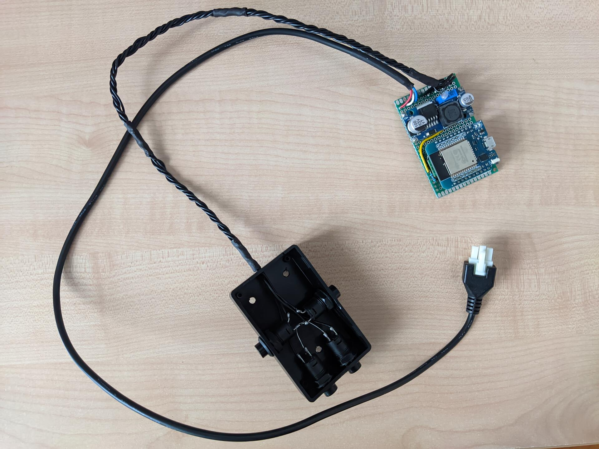

## Features

- **Home Assistant** Auto Discovery
- **MQTT** Control
- **Physical buttons**: Up, Down, Memory 1, Memory 2
- **Virtual controls**: Up, Down, Stop, Memory 1-4, Recalibrate, Restart, Child Lock, Min/Max Height

## Buttons Behavior

- **UP/DOWN**: Hold to move desk. Release to stop
- **UP+DOWN**: Hold both for 10 seconds to trigger recalibration (drives desk to bottom and resets)
- **Memory**:
  - Short press (< 5 seconds) recalls the stored position
  - Long press (≥ 5 seconds) stores the current desk height
- **Physical override**: Buttons can interrupt MQTT/HA commands for safety reasons
- **Child Lock**: While enabled, all buttons are disabled. MQTT/HA control is still active

## Configuration

Change the following variables in `bekant-mqtt32.ino` before flashing your ESP:

```cpp
const char* ssid = "YOUR_WIFI_SSID";
const char* password = "YOUR_WIFI_PASSWORD";
const char* mqtt_server = "YOUR_MQTT_SERVER_IP";
const int mqtt_port = 1883;
const char* mqtt_client_id = "bekant_desk";
```

## MQTT Topics

<details>
<summary>Click to expand</summary>

### State Topics
- `bekant/height` - Raw encoder position (integer)
- `bekant/height_cm` - Current height in centimeters (float, 1 decimal)
- `bekant/height_percent` - Height as percentage (0-100, integer)
- `bekant/status` - Desk status: `stopped`, `opening`, `closing`
- `bekant/availability` - Device availability: `online` or `offline`
- `bekant/wifi_rssi` - WiFi signal strength in dBm (integer)
- `bekant/min_height_cm` - Minimum height limit in cm (integer)
- `bekant/max_height_cm` - Maximum height limit in cm (integer)
- `bekant/child_lock` - Child lock state: `ON` or `OFF`
- `bekant/memory1_height_cm` - Memory 1 stored height in cm (float)
- `bekant/memory2_height_cm` - Memory 2 stored height in cm (float)
- `bekant/memory3_height_cm` - Memory 3 stored height in cm (float)
- `bekant/memory4_height_cm` - Memory 4 stored height in cm (float)
- `bekant/log` - Debug/log messages (string)

### Command Topics
- `bekant/command` - Main command topic. Accepts:
  - `up` - Move desk up
  - `down` - Move desk down
  - `stop` - Stop desk movement
  - `reset` - Recalibrate desk (drive to bottom and reset)
  - `height-cm XXX` - Move to specific height in cm
  - `height-percent XX` - Move to percentage (0-100)
  - `height XXXX` - Move to raw encoder position

- `bekant/set_min_height` - Set minimum height limit (integer, cm)
- `bekant/set_max_height` - Set maximum height limit (integer, cm)
- `bekant/set_child_lock` - Enable/disable child lock: `ON` or `OFF`
- `bekant/set_memory1_height` - Set Memory 1 height (float, cm)
- `bekant/set_memory2_height` - Set Memory 2 height (float, cm)
- `bekant/set_memory3_height` - Set Memory 3 height (float, cm)
- `bekant/set_memory4_height` - Set Memory 4 height (float, cm)
- `bekant/memory1_recall` - Recall Memory 1 position (send `PRESS`)
- `bekant/memory2_recall` - Recall Memory 2 position (send `PRESS`)
- `bekant/memory3_recall` - Recall Memory 3 position (send `PRESS`)
- `bekant/memory4_recall` - Recall Memory 4 position (send `PRESS`)
- `bekant/restart` - Restart ESP32 (send `RESTART`)

### Examples

```bash
# Move desk up
mosquitto_pub -h 192.168.0.100 -t bekant/command -m "up"

# Stop desk
mosquitto_pub -h 192.168.0.100 -t bekant/command -m "stop"

# Move to 100cm height
mosquitto_pub -h 192.168.0.100 -t bekant/command -m "height-cm 100"

# Move to 50% height
mosquitto_pub -h 192.168.0.100 -t bekant/command -m "height-percent 50"

# Recall Memory 1 position
mosquitto_pub -h 192.168.0.100 -t bekant/memory1_recall -m "PRESS"

# Set Memory 1 to 90cm
mosquitto_pub -h 192.168.0.100 -t bekant/set_memory1_height -m "90"

# Enable child lock
mosquitto_pub -h 192.168.0.100 -t bekant/set_child_lock -m "ON"

# Set min height to 70cm
mosquitto_pub -h 192.168.0.100 -t bekant/set_min_height -m "70"

# Recalibrate desk
mosquitto_pub -h 192.168.0.100 -t bekant/command -m "reset"
```
</details>

## Hardware

**Required Components**

- 1x MCP2003B LIN Transceiver ([electronic-mag.ro](https://www.electronic-mag.ro/interfete-circuite-integrate-altele/192710-ic-interfata-emitator-receptor-20kbps-55-30vdc-smd-so8.html) / [image](images/hardware/requirements/mcp2003b.jpg))
- 1x SOP8 to DIP8 PCB ([aliexpress.com](https://www.aliexpress.com/item/1891086490.html) / [image](images/hardware/requirements/sop8-to-dip8-pcb.jpg))
- 1x ESP32 D1 Mini ([aliexpress.com](https://www.aliexpress.com/item/4000650379995.html) / [image](images/hardware/requirements/esp32-d1-mini.jpg))
- 1x Buck Converter 29V to 12V (LM2596HVS) ([aliexpress.com](https://www.aliexpress.com/item/1005009041730920.html) / [image](images/hardware/requirements/buck-converter-12v.jpg))
- 1x Buck Converter 12V to 5V ([aliexpress.com](https://www.aliexpress.com/item/32826540392.html) / [image](images/hardware/requirements/buck-converter-5v.jpg))
- 1x Resistor 1kΩ 0.25W ([aliexpress.com](https://www.aliexpress.com/item/32952657927.html))
- 3x Resistor 2.2kΩ 0.25W ([aliexpress.com](https://www.aliexpress.com/item/32952657927.html))
- 1x PCB 70x50 ([aliexpress.com](https://www.aliexpress.com/item/1005007977006793.html))
- 4x 5m 24AWG wires (red, yellow, green, black) ([aliexpress.com](https://www.aliexpress.com/item/1005004336218242.html))
- 1x Box 80x50x26 ([aliexpress.com](https://www.aliexpress.com/item/1005006374922625.html) / [image](images/hardware/requirements/box.jpg))

**Optional Components (for physical buttons)**

- 4x Momentary Buttons ([aliexpress.com](https://www.aliexpress.com/item/1005009915408937.html) / [image](images/hardware/requirements/buttons.jpg))
- 4x 100nF ceramic capacitors ([aliexpress.com](https://www.aliexpress.com/item/32971478818.html) / [image](images/hardware/requirements/100nf-ceramic-capacitor.jpg))
- 1x Box 80x50x26 ([aliexpress.com](https://www.aliexpress.com/item/1005006374922625.html) / [image](images/hardware/requirements/box.jpg))

**Notes**

- Physical buttons are optional. The controller can be used entirely through MQTT or Home Assistant.
- I initially tried [this](https://www.aliexpress.com/item/1005006348310876.html) TJA1020 based transciever but didn't manage to make it work so I went with the known to work MCP2003B.
- Buck converters don't have to be exactly the ones that I used, I just used what I already had.

**Button Interference**

I had pretty bad interference while reading the buttons because I used 50cm 24AWG wires between the controller box and the buttons box. That's why I implemented debouncing and added 100nF capacitors. There's one cap for each button. I soldered each leg of the cap to each leg of the button.

I used overkill 250V film caps because that's what I had laying around but the 50V ceramic ones are more common and cheap to buy.

If you go with a single box for both parts then you're probably not going to need capacitors. I went with two boxes in order to keep sensitive electronics far from children and liquids.

## Schematic

Here's my highly skilled professional grade schematic

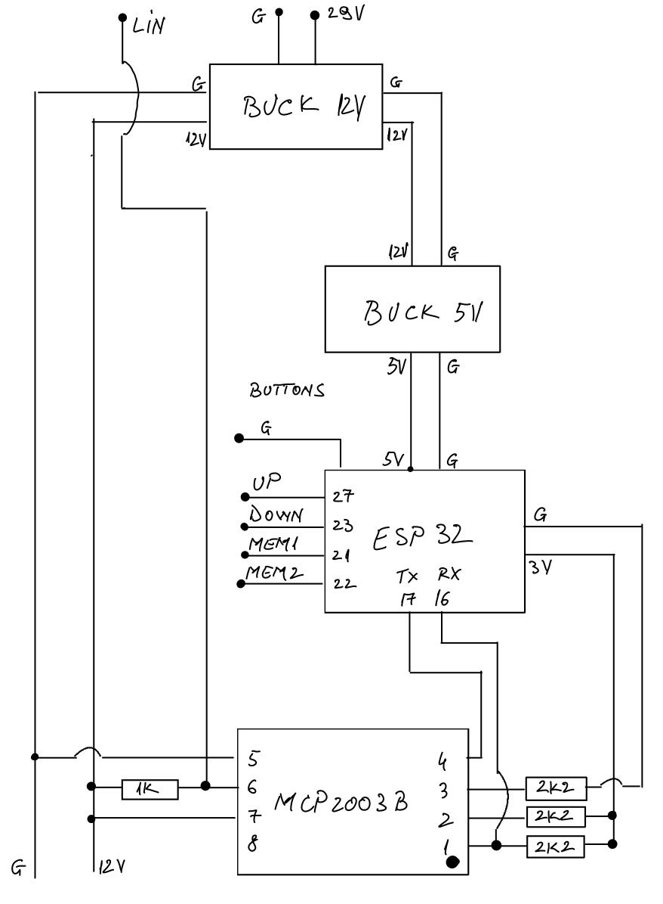

## Home Assistant


<details>
<summary>Click to expand yaml</summary>

```yaml
type: grid
cards:
  - type: heading
    heading: Desk
    heading_style: title
  - type: custom:mushroom-cover-card
    entity: cover.bekant_desk_bekant_desk
    name: Desk
    show_buttons_control: true
    show_position_control: false
    layout: horizontal
    tap_action:
      action: more-info
  - square: false
    type: grid
    columns: 4
    cards:
      - type: custom:mushroom-entity-card
        entity: button.bekant_desk_memory_3_recall
        icon: mdi:numeric-3
        primary_info: name
        secondary_info: none
        fill_container: true
        tap_action:
          action: perform-action
          perform_action: button.press
          target:
            entity_id: button.bekant_desk_memory_3_recall
        name: Min
        layout: vertical
        icon_type: none
      - type: custom:mushroom-entity-card
        entity: button.bekant_desk_memory_1_recall
        icon: mdi:numeric-1
        primary_info: name
        fill_container: true
        tap_action:
          action: perform-action
          perform_action: button.press
          target:
            entity_id: button.bekant_desk_memory_1_recall
        icon_type: none
        secondary_info: none
        layout: vertical
        name: Sit
      - type: custom:mushroom-entity-card
        entity: button.bekant_desk_memory_2_recall
        icon: mdi:numeric-2
        primary_info: name
        secondary_info: none
        fill_container: true
        tap_action:
          action: perform-action
          perform_action: button.press
          target:
            entity_id: button.bekant_desk_memory_2_recall
        name: Stand
        layout: vertical
        icon_type: none
      - type: custom:mushroom-entity-card
        entity: button.bekant_desk_memory_4_recall
        icon: mdi:numeric-4
        primary_info: name
        secondary_info: none
        fill_container: true
        tap_action:
          action: perform-action
          perform_action: button.press
          target:
            entity_id: button.bekant_desk_memory_4_recall
        name: Max
        layout: vertical
        icon_type: none
```
</details>

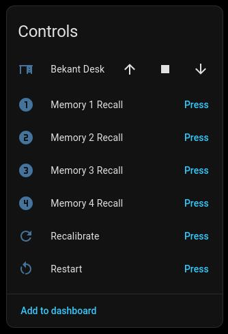
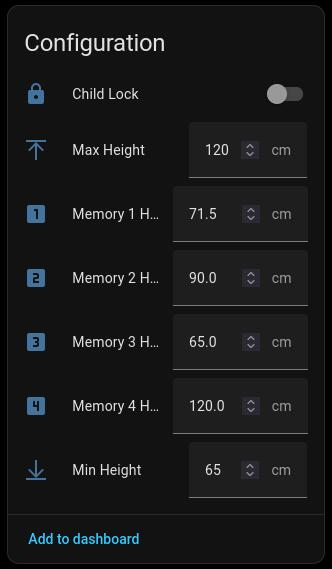
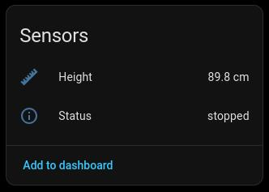

## Hardware Images

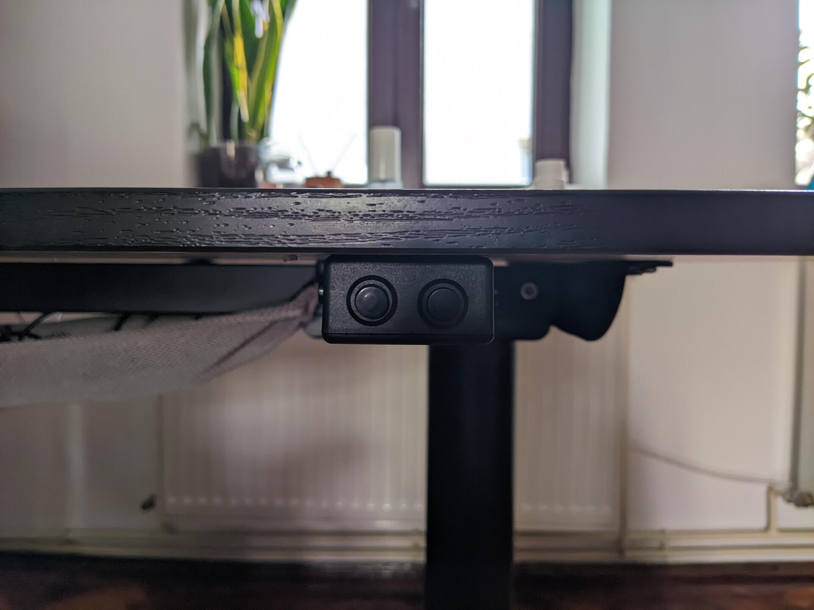
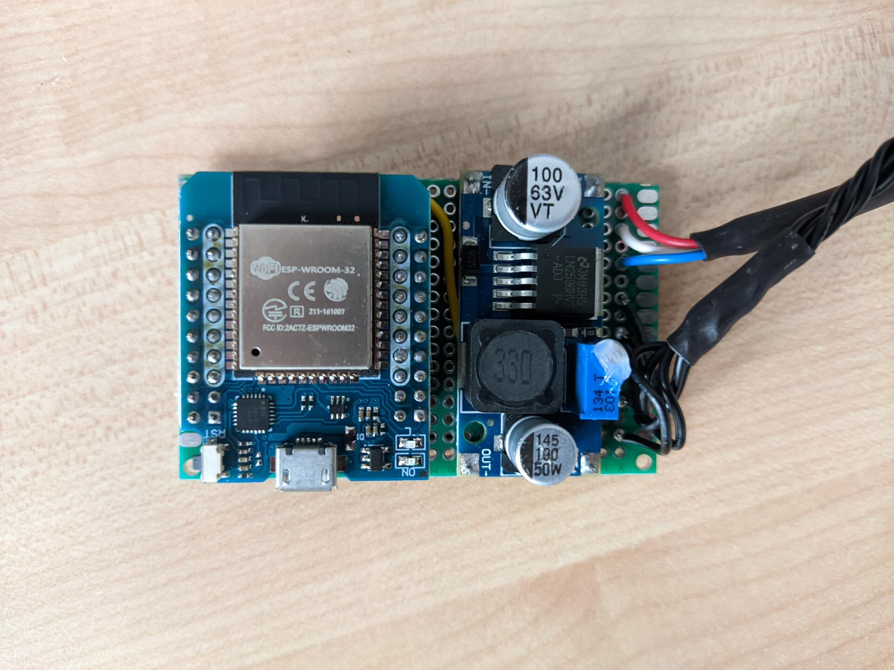

<details>
<summary>Click to show more</summary>


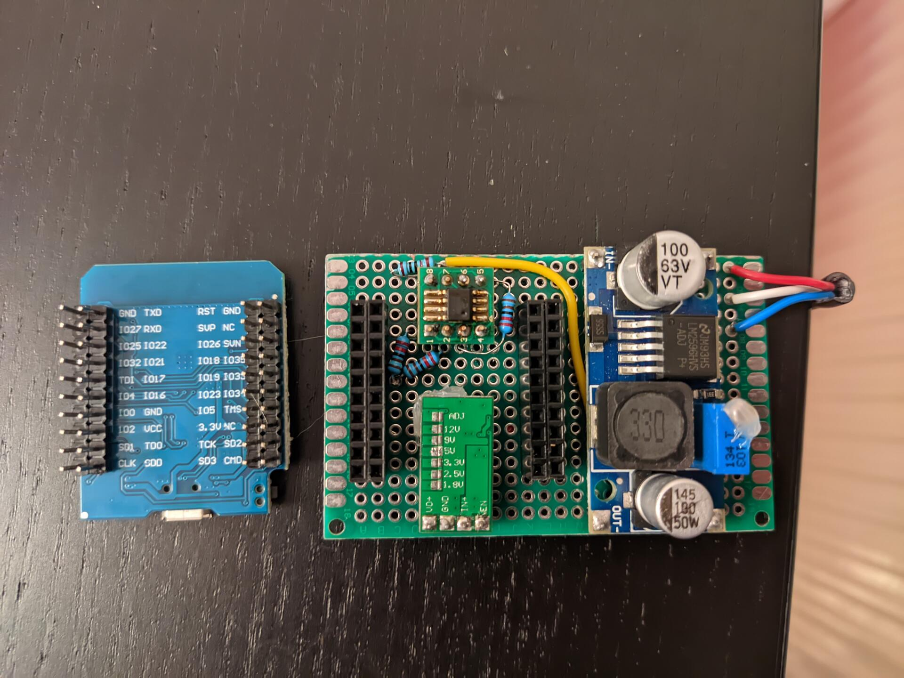

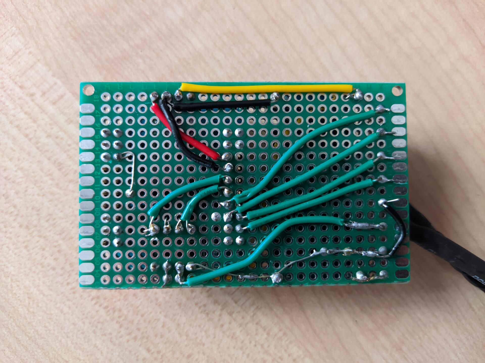
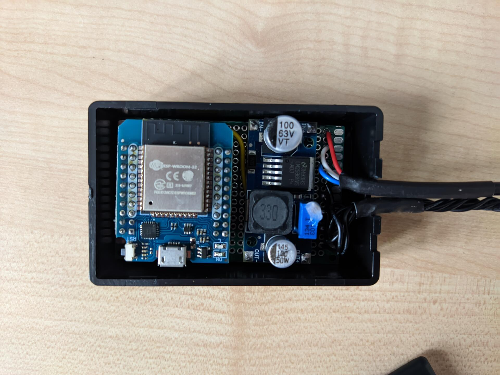

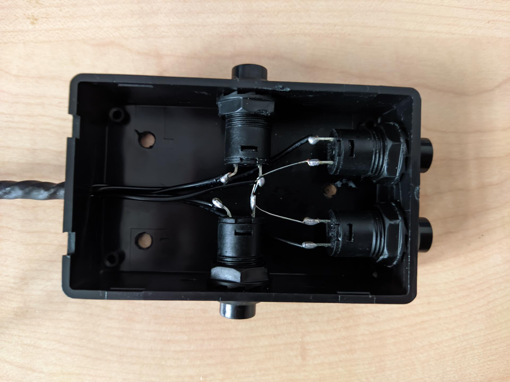
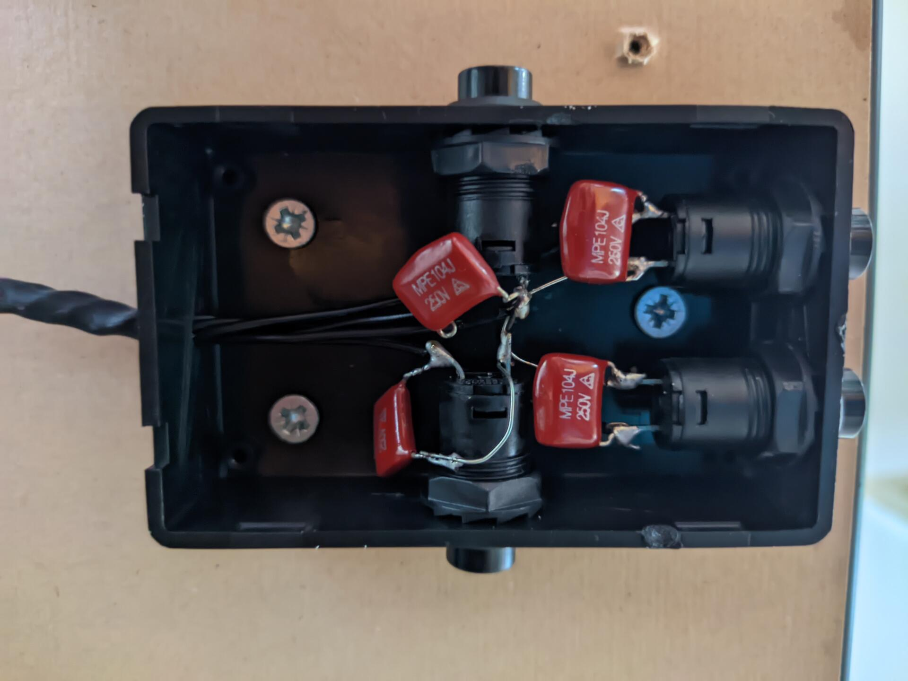
</details>

## References

- [trainman419/bekant](https://github.com/trainman419/bekant)
- [gcormier/megadesk](https://github.com/gcormier/megadesk)
- [satrik/esp8266-bekant](https://github.com/satrik/esp8266-bekant)
- [robin7331/IKEA-Hackant](https://github.com/robin7331/IKEA-Hackant)

## Disclaimer

This project is provided as is. You'll need hardware and software knowledge in order to build this. Even so, you might damage your desk if you're not careful.

## License

Do whatever as long as you don't break the licenses of the ones I inspired from.
