# IKEA Bekant ESP32 MQTT Controller

Complete replacement controller for the IKEA Bekant motorized sit/stand desk with ESP32, MQTT and Home Assistant integration.

## Overview

This project is a smart controller for the IKEA Bekant height-adjustable desk. It completely replaces the original controller by communicating directly with the desk motors via the LIN (Local Interconnect Network) bus protocol.

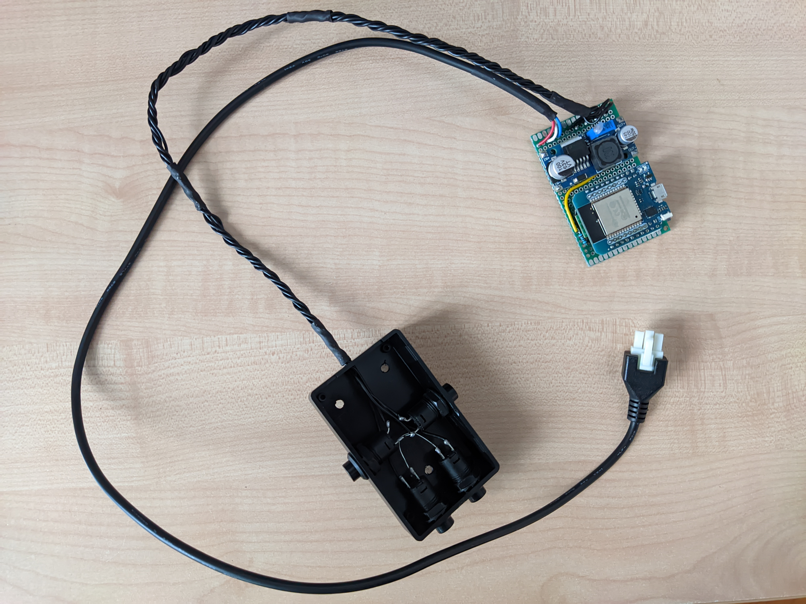
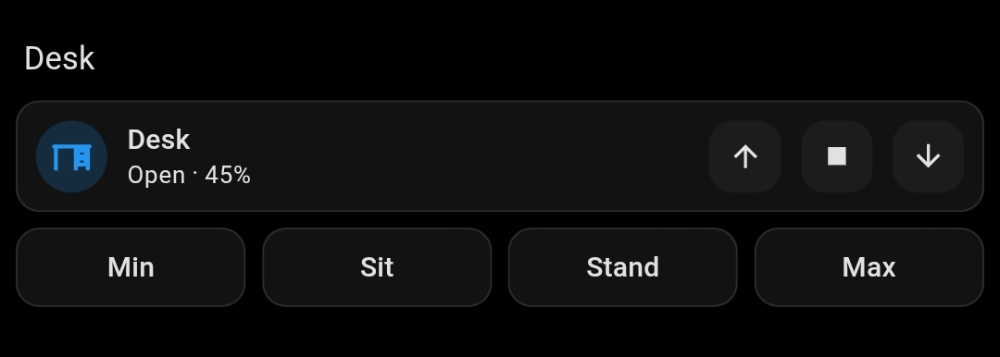

## Features

- **Physical buttons**: Up, Down, Memory 1, Memory 2 (optional - see Hardware section)
  - Memory buttons: Short press = recall position, Long press (5 seconds) = store current position
  - Both UP+DOWN buttons held for 10 seconds = Recalibrate desk
  - Physical buttons can override/interrupt MQTT commands
- **MQTT**: Full control via MQTT topics (see MQTT Topics section below)
- **Home Assistant**:
  - Auto Discovery
  - Up/Stop/Down controls
  - Memory 1-4 set/recall (Memory 1-2 have physical buttons, Memory 3-4 are MQTT/HA only)
  - Recalibrate
  - Child Lock (disables physical buttons and stops desk movement)
  - Restart
  - Min/Max height adjustable limits (default: 65-120cm)
  - Current height sensor
- **Safety**:
  - Automatic ESP32 restart on LIN communication failures
  - Height limits enforced to prevent damage
  - Smooth stop sequences for safe operation

## Physical Buttons Behavior

- **UP/DOWN buttons**: Hold to move desk up/down. Release to stop. Movement continues while held.
- **Memory 1/2 buttons**:
  - **Short press** (< 5 seconds): Recalls the stored position for that memory slot
  - **Long press** (≥ 5 seconds): Stores the current desk height to that memory slot
- **Both UP+DOWN buttons**: Hold both buttons for 10 seconds to trigger recalibration (drives desk to bottom and resets)
- **Physical override**: Physical buttons can interrupt and override MQTT commands. When a physical button is pressed during an MQTT-controlled movement, the desk will smoothly stop at the current position.
- **Child Lock**: While child lock is enabled, all physical buttons are disabled. MQTT/HA control is still active.

## Hardware

**Required Components:**
- 1x MCP2003B LIN Transceiver [[electronic-mag.ro]](https://www.electronic-mag.ro/interfete-circuite-integrate-altele/192710-ic-interfata-emitator-receptor-20kbps-55-30vdc-smd-so8.html) [[image]](images/hardware/requirements/mcp2003b.png)
- 1x SOP8 to DIP8 PCB [[aliexpress.com]](https://www.aliexpress.com/item/1891086490.html) [[image]](images/hardware/requirements/sop8-to-dip8-pcb.png)
- 1x ESP32 D1 Mini [[aliexpress.com]](https://www.aliexpress.com/item/4000650379995.html) [[image]](images/hardware/requirements/esp32-d1-mini.png)
- 1x Buck Converter 29V to 12V (LM2596HVS) [[aliexpress.com]](https://www.aliexpress.com/item/1005009041730920.html) [[image]](images/hardware/requirements/buck-converter-12v.png)
- 1x Buck Converter 12V to 5V [[aliexpress.com]](https://www.aliexpress.com/item/32826540392.html) [[image]](images/hardware/requirements/buck-converter-5v.png)
- 1x Resistor 1kΩ 0.25W [[aliexpress.com]](https://www.aliexpress.com/item/32952657927.html)
- 3x Resistor 2.2kΩ 0.25W [[aliexpress.com]](https://www.aliexpress.com/item/32952657927.html)
- 1x PCB 70x50 [[aliexpress.com]](https://www.aliexpress.com/item/1005007977006793.html)
- 4x 5m 24AWG wires (red, yellow, green, black) [[aliexpress.com]](https://www.aliexpress.com/item/1005004336218242.html)
- 1x Box 80x50x26 [[aliexpress.com]](https://www.aliexpress.com/item/1005006374922625.html) [[image]](images/hardware/requirements/box.png)

**Optional Components (for physical buttons):**
- 4x Momentary Buttons [[aliexpress.com]](https://www.aliexpress.com/item/1005009915408937.html) [[image]](images/hardware/requirements/buttons.png)
- 4x 100nF ceramic capacitors [[aliexpress.com]](https://www.aliexpress.com/item/32971478818.html) [[image]](images/hardware/requirements/100nf-ceramic-capacitor.png)
- 1x Box 80x50x26 [[aliexpress.com]](https://www.aliexpress.com/item/1005006374922625.html) [[image]](images/hardware/requirements/box.png)

**Note on buttons:**
Physical buttons are optional. The controller can be used entirely through MQTT or Home Assistant.

**Note on LIN transciever:**
I initially tried [this](https://www.aliexpress.com/item/1005006348310876.html) TJA1020 based transciever but didn't manage to make it work so I went with the known to work MCP2003B.

**Note on buck converters:**
They don't have to be exactly the ones that I used, I just used what I already had.

## Schematic

Here's my highly skilled professional grade schematic

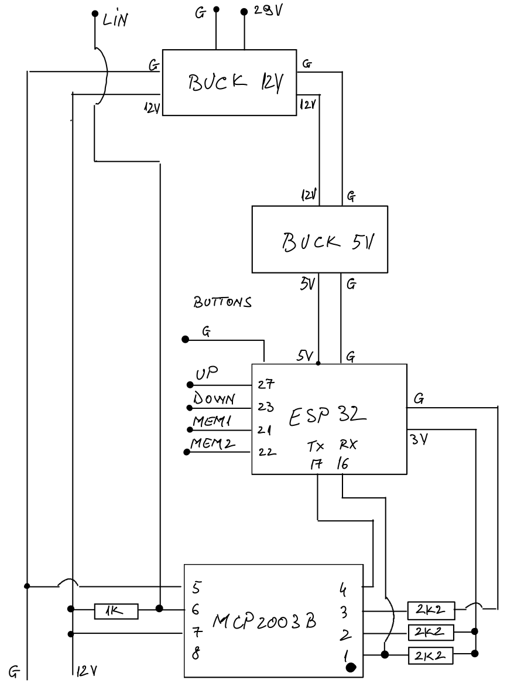

## Button Interference

Because I used 50cm 24AWG wires I had pretty bad interference when reading the buttons. That's why I implemented debouncing and added 100nF capacitors. There's one cap for each button. Solder each leg of the cap to each leg of the button.

I used overkill 250V film caps because that's what I had laying around but the 50V ceramic ones are more common and cheap to buy.

## Configuration

Before building and uploading the firmware, you should configure the following variables in `bekant-mqtt32.ino`:

```cpp
const char* ssid = "your_wifi_ssid";
const char* password = "your_wifi_password";
const char* mqtt_server = "your_mqtt_server_ip";
const int mqtt_port = 1883;
const char* mqtt_client_id = "bekant_desk";
```

## MQTT Topics

If you're not using Home Assistant, you can control the desk directly via MQTT using the following topics:

### State Topics (Published by device)
- `bekant/height` - Raw encoder position (integer)
- `bekant/height_cm` - Current height in centimeters (float, 1 decimal)
- `bekant/height_percent` - Height as percentage (0-100, integer)
- `bekant/status` - Desk status: `stopped`, `opening`, `closing`
- `bekant/availability` - Device availability: `online` or `offline`
- `bekant/wifi_rssi` - WiFi signal strength in dBm (integer)
- `bekant/min_height_cm` - Minimum height limit in cm (integer)
- `bekant/max_height_cm` - Maximum height limit in cm (integer)
- `bekant/child_lock` - Child lock state: `ON` or `OFF`
- `bekant/memory1_height_cm` - Memory 1 stored height in cm (float)
- `bekant/memory2_height_cm` - Memory 2 stored height in cm (float)
- `bekant/memory3_height_cm` - Memory 3 stored height in cm (float)
- `bekant/memory4_height_cm` - Memory 4 stored height in cm (float)
- `bekant/log` - Debug/log messages (string)

### Command Topics (Subscribe to control device)
- `bekant/command` - Main command topic. Accepts:
  - `up` - Move desk up
  - `down` - Move desk down
  - `stop` - Stop desk movement
  - `reset` - Recalibrate desk (drive to bottom and reset)
  - `height-cm XXX` - Move to specific height in cm
  - `height-percent XX` - Move to percentage (0-100)
  - `height XXXX` - Move to raw encoder position

- `bekant/set_min_height` - Set minimum height limit (integer, cm)
- `bekant/set_max_height` - Set maximum height limit (integer, cm)
- `bekant/set_child_lock` - Enable/disable child lock: `ON` or `OFF`
- `bekant/set_memory1_height` - Set Memory 1 height (float, cm)
- `bekant/set_memory2_height` - Set Memory 2 height (float, cm)
- `bekant/set_memory3_height` - Set Memory 3 height (float, cm)
- `bekant/set_memory4_height` - Set Memory 4 height (float, cm)
- `bekant/memory1_recall` - Recall Memory 1 position (send `PRESS`)
- `bekant/memory2_recall` - Recall Memory 2 position (send `PRESS`)
- `bekant/memory3_recall` - Recall Memory 3 position (send `PRESS`)
- `bekant/memory4_recall` - Recall Memory 4 position (send `PRESS`)
- `bekant/restart` - Restart ESP32 (send `RESTART`)

### Example MQTT Commands

```bash
# Move desk up
mosquitto_pub -h 192.168.0.100 -t bekant/command -m "up"

# Move desk down
mosquitto_pub -h 192.168.0.100 -t bekant/command -m "down"

# Stop desk
mosquitto_pub -h 192.168.0.100 -t bekant/command -m "stop"

# Move to 100cm height
mosquitto_pub -h 192.168.0.100 -t bekant/command -m "height-cm 100"

# Move to 50% height
mosquitto_pub -h 192.168.0.100 -t bekant/command -m "height-percent 50"

# Recall Memory 1 position
mosquitto_pub -h 192.168.0.100 -t bekant/memory1_recall -m "PRESS"

# Set Memory 1 to current position (90cm)
mosquitto_pub -h 192.168.0.100 -t bekant/set_memory1_height -m "90"

# Enable child lock
mosquitto_pub -h 192.168.0.100 -t bekant/set_child_lock -m "ON"

# Set min height to 70cm
mosquitto_pub -h 192.168.0.100 -t bekant/set_min_height -m "70"

# Recalibrate desk
mosquitto_pub -h 192.168.0.100 -t bekant/command -m "reset"
```

## Home Assistant Screenshots


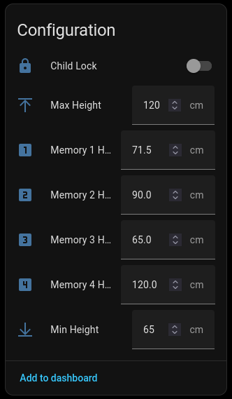
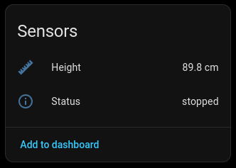
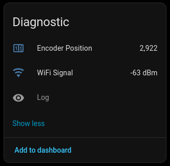

## Hardware Images


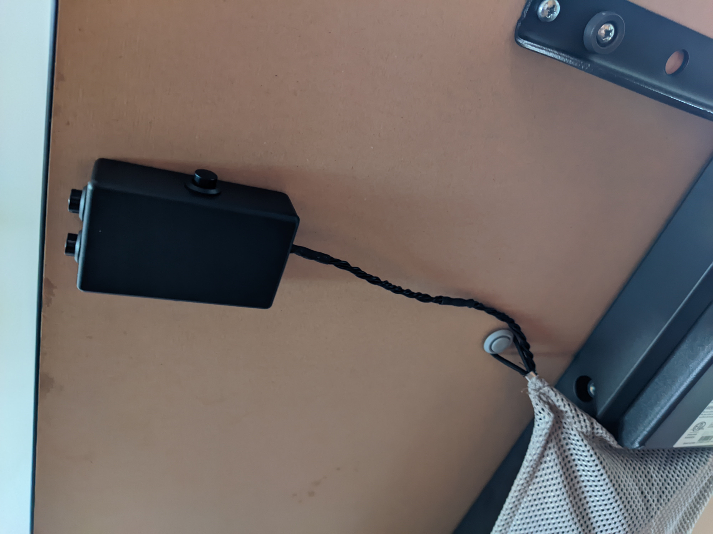
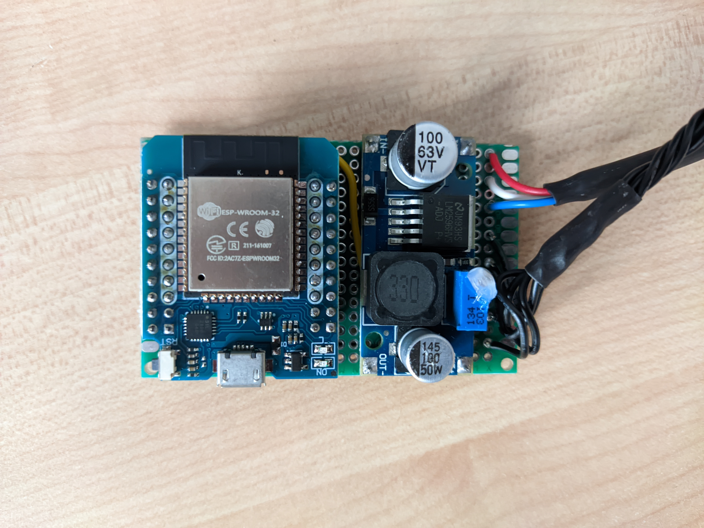
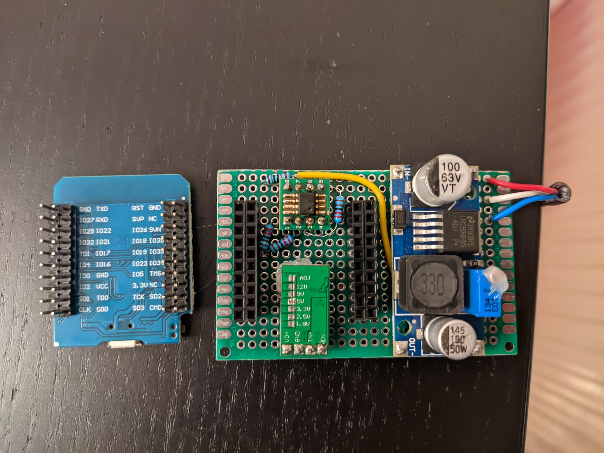
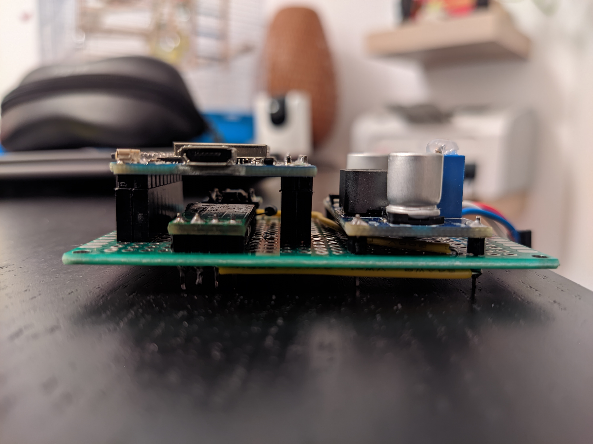
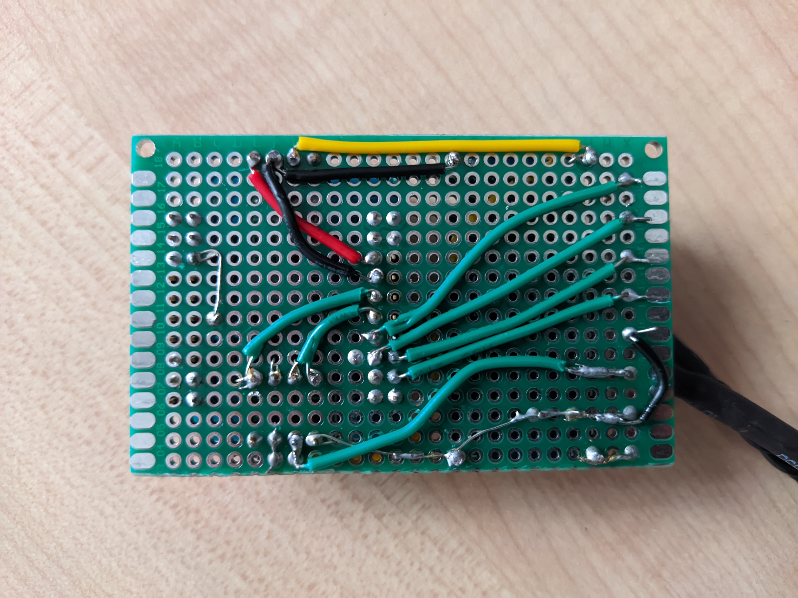


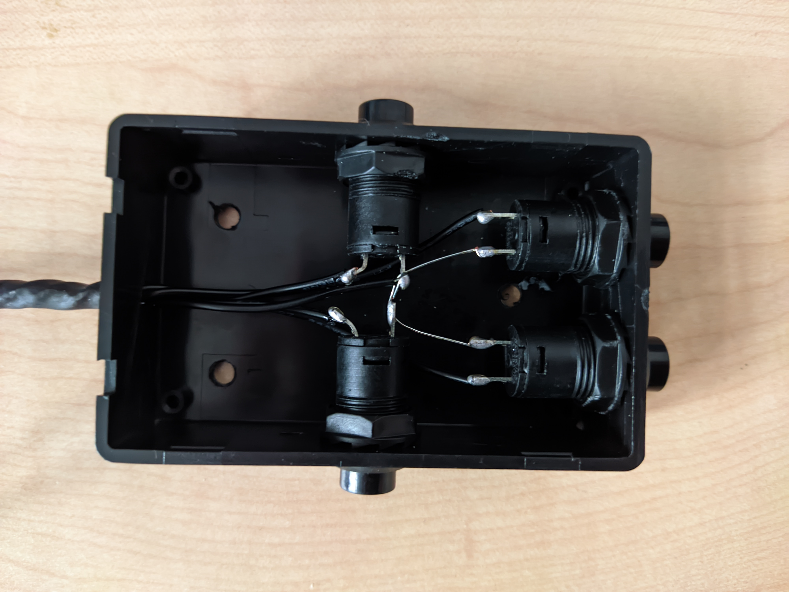
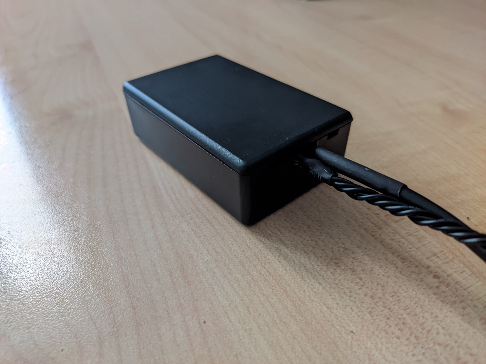
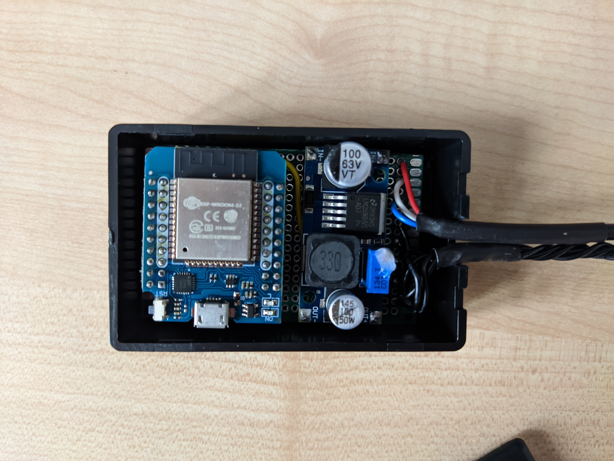

## References

- [trainman419/bekant](https://github.com/trainman419/bekant)
- [gcormier/megadesk](https://github.com/gcormier/megadesk)
- [satrik/esp8266-bekant](https://github.com/satrik/esp8266-bekant)
- [robin7331/IKEA-Hackant](https://github.com/robin7331/IKEA-Hackant)

## Disclaimer

This project is provided as is. You'll need hardware and software knowledge in order to build this. Even so, you might damage your desk if you're not careful.

## License

Do whatever as long as you don't break the licenses of the ones I inspired from.
